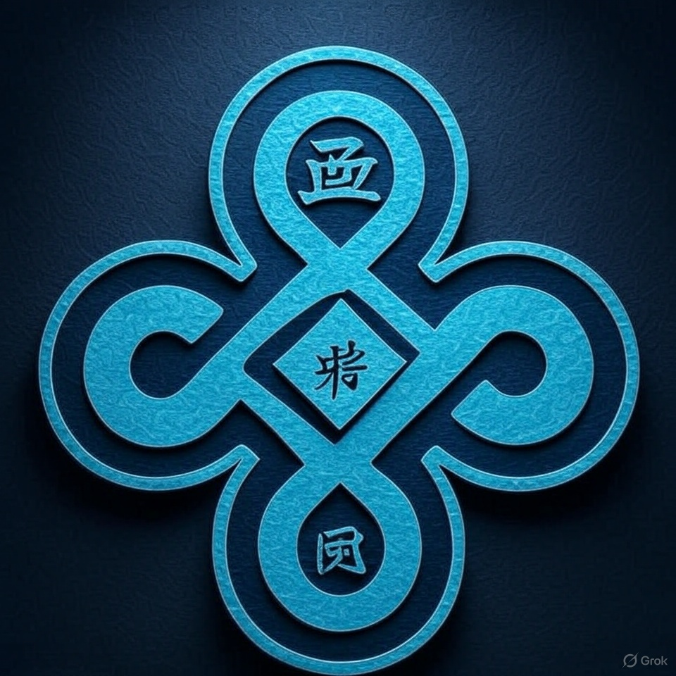

  

<h1 align="center">SENSEI</h1>
<h2 align="center">Semantic Extraction, Navigation, Search, Enrichment and Inference</h2>

SENSEI is a core part of SEN and provides an infrastructure for:
* *S*emantic *E*xtraction: extract semantics hidden in files, like structure, entities or relations
* *N*avigation: provide a way to navigate linked data using plugins, integrating with applications for resolving 
  relation properties (e.g. references to pages in a document)
* *S*earch: search for missing metadata using available fragments and keys (ISBN, IMDB id, DOI,...)
* *E*nrichment: query open data sources for metadata and enrich local files, e.g. Book or Movie entities, PDF papers,...
* *I*dentification: determine the semantic type of a given file, e.g. a Paper, Invoice or ebook from a PDF document

SEN uses native queries for plugins supporting a given FileType and Feature (any combination of the above).
The plugin gets called with the original file reference and all properties of the relation.

More documentation is coming up soon and will be available in the Wiki.

# Colophon / About the Logo

In Japanese, the kanji (Japanese symbols) in the logo can be translated as:
* 将 (shō) - "general" or "leader" - senseis act as leaders and guides in their discipline.
* 特 (toku) - "special" or "virtue/merit" - this connects to the special qualities and virtues a sensei embodies and teaches.
* 風 (fū) - "wind" or "style/way" - this relates to the teaching style or "way" (as in martial arts "do" - the way/path) that a sensei represents.

Together, these symbols represent the concept of a sensei's special leadership style or virtuous way of teaching - the particular manner in which a master
guides students along their path. The ornate knot design reinforces this idea of interconnectedness and the binding relationship between teacher and student.
These characters capture the essence of what makes a true teacher: leadership (将), special virtue (特), and a distinctive way or style (風) of guiding others.

(Note: I sadly don't speak Japanese so please correct me if this is wrong, just love references to Japanese culture as a nod to BeOS and Haiku, and of course
to the origins of these references).
